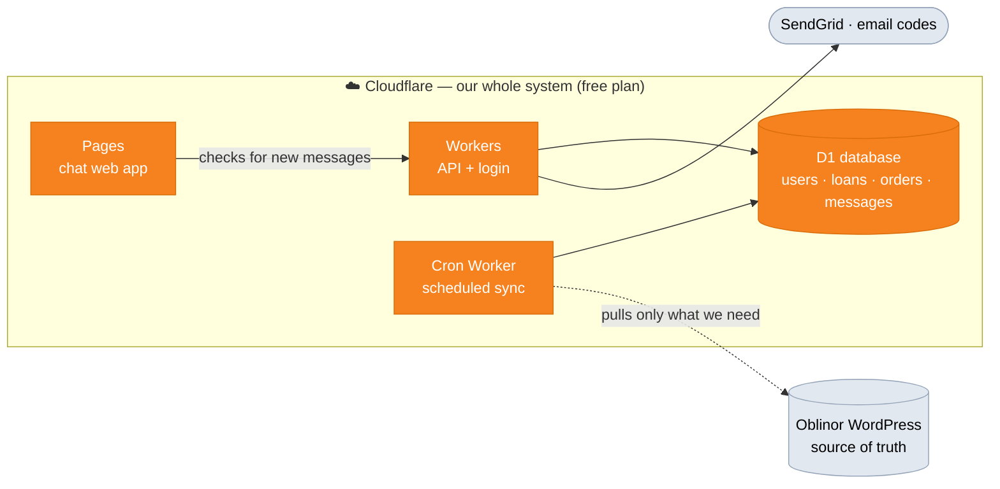

# Loaner ↔ Investor Chat System — Implementation Plan (Cloudflare)

**Status:** DRAFT for review. Nothing is built yet. Do not start implementation until this plan is agreed.
**Author:** drafted 2026-06-15 · revised to Cloudflare stack 2026-06-15
**Hosting:** **100% Cloudflare** — frontend, backend, database, realtime, and the sync job all run on Cloudflare.
**Relationship to existing systems:** **standalone.** We do **not** reuse `oblinor-chat-backend` or its Postgres. We pull a **minimal slice** of data from the Oblinor WordPress API into our own Cloudflare database.

---

## 1. Goal in one sentence

Let an investor (långiver) and a loaner (låntaker, e.g. *Veien Hjem Trondheim AS*) exchange **private 1-to-1 messages**, where an investor may only message a loaner they have actually invested in, and a loaner sees an inbox of every investor across **all** of their loans — built entirely on Cloudflare, fed by a small, purpose-built sync from Oblinor.

---

## 2. Decisions locked (review 2026-06-15)

| # | Decision | Choice | Consequence |
|---|----------|--------|-------------|
| 1 | **Topology** | Private 1-to-1 threads | One thread per `(loaner, investor)` pair. Investors never see each other. |
| 2 | **Scope** | Per loaner (borrower) | An investor in any of a loaner's loans shares **one** thread with that loaner. |
| 3 | **Auth** | Standalone login (email OTP) | Our system owns sessions; accounts are **linked to the Oblinor user id** so eligibility derives from orders. |
| 4 | **Realtime** | **Polling for v1 (free); WebSockets later** | v1 delivers messages by short-interval polling over plain Workers + D1 — **no Durable Objects, nothing to pay**. WebSockets (via free-tier or paid Durable Objects) is a later phase if/when instant delivery and scale require it. The DB + message API are identical either way, so the upgrade needs no rework. |
| 5 | **Loaner = team** | Multiple contact persons | A loaner's inbox can be shared by ≥1 contact persons. |
| 6 | **OTP delivery** | Email only, via SendGrid | Login codes emailed via SendGrid (Worker calls the SendGrid API). |
| 7 | **Oversight** | Back-office watchdog | Oblinor staff can read all chats; moderation (lock/delete) is admin-only; fully audited. |
| 8 | **Hosting** | **All on Cloudflare** | Pages (frontend) + Workers (API) + Durable Objects (sockets) + D1 (database) + Cron (sync). No Postgres, no Cloud Run. |
| 9 | **Data sourcing** | **Minimal pull from Oblinor** | We sync only loaners, loans, orders, and **users who have invested** — and only the specific fields in §3. Nothing else. |

---

## 3. Data we pull from Oblinor (minimal — and ONLY this)

A Cloudflare **Cron Worker** calls the Oblinor WordPress REST API on a schedule, authenticates as the service admin (`POST /wp-json/oblinor/admin/v2/authenticate` → token), and upserts **only** the fields below into our D1 database. We do **not** mirror the full Oblinor data model.

> Scope guard for stage 1: only **loaners, loans, orders, and investors who have actually invested**. No full user base, no documents, no rich loan metadata.

### 3.1 Loaner (låntaker)
| Our field | Oblinor source | Example |
|---|---|---|
| `loaner_id` | `loanerId` | 5811 |
| `org_number` | Org.nummer | 911909499 |
| `company_name` | Firmanavn | Veien Hjem Trondheim AS |
| `contact_person` | Kontaktperson | Tom Jacobsen |
| `username` | Brukernavn | post@huslykke.no |
| `email` | E-post | mona@lybo.no |
| `phone` | Telefon | 46174000 |
| `address` | Adresse | Værnesgata 9, 7503 Stjørdal |

### 3.2 Investor (user who invested)
| Our field | Oblinor source | Example |
|---|---|---|
| `user_id` | userId | 74 |
| `name` | Navn | Jonny Mellby Løvaas |
| `email` | E-post | Jonnyml@online.no |

### 3.3 Loan
| Our field | Oblinor source | Example |
|---|---|---|
| `loan_id` | loanId | 177757 |
| `loaner_id` | (owning loaner) | 5811 |
| `amount` | `summary.amountTotal` | — |
| `address` | `mapaddress` | — |
| `security_bail` | `security_bail[]` `{amount, owner, owner_name}` | stored as JSON |

### 3.4 Order (investment)
| Our field | Oblinor source | Example |
|---|---|---|
| `id` | id | 177787 |
| `loan_id` | (owning loan) | 177757 |
| `user_id` | userId | 74 |
| `shares` | shares | 10 |
| `amount` | amount | 50000 |
| `username` | username | vgronbeck@gmail.com |
| `bank_in` | bankIn | 50000 |

**Eligibility comes straight from this:** investor *I* may chat with loaner *B* ⟺ there is an **order** by `user_id = I` on a **loan** whose `loaner_id = B`. (Refine "counts as invested" — e.g. `bank_in > 0` — in §11.)

> The values above are **illustrative sample data** to show field shapes, not real records. The only design decision they imply: which field is the authoritative **login email** for an investor (the user `email`) vs the per-order `username` — see §11.

---

## 4. Cloudflare architecture

```
Cloudflare Pages            Cloudflare Workers                              D1 (SQLite)
  (React + Vite SPA)  ◀────▶  API Worker (Hono)   ◀──────────────────────▶  relational data
       │   polls            · auth (OTP+JWT)                                 · loaners/loans
       │   every ~3-5s      · REST chat endpoints                           · orders/investors
       └────────────────▶  · admin/watchdog                                · threads/messages
                                    │                                        · accounts/agents
                                    ▼
                              Cron Worker (sync)  ──HTTPS──▶  Oblinor WordPress REST API (source of truth)
                                    │
                              SendGrid API (OTP emails)

  ( later, optional — instant delivery: Durable Objects "ThreadRoom" holding WebSockets )
```

**Components**
- **Cloudflare Pages** — the chat web app (**React + Vite SPA**).
- **API Worker** (Hono router) — auth, REST chat endpoints, admin/watchdog endpoints. Stateless; all state in D1 / KV.
- **D1** — SQLite database for all relational data and message history (the durable source of truth for the chat).
- **KV** — short-lived OTP codes (native TTL) and optional rate-limit counters.
- **Cron Trigger Worker** — scheduled sync that pulls the §3 slice from Oblinor and upserts into D1.
- **Durable Objects** — *not in v1.* Reserved for the later WebSocket upgrade (§8.2): one **`ThreadRoom`** per thread with Hibernatable WebSockets. v1 uses polling instead, so there is **nothing to pay**.
- **R2** — reserved for file attachments (out of v1).
- **Secrets** (wrangler): Oblinor admin creds, `CHAT_JWT_SECRET`, `SENDGRID_API_KEY`.

---

## 5. Database schema (D1 / SQLite)

SQLite types (`INTEGER`, `TEXT`, `REAL`), `strftime`/ISO-8601 text for timestamps, JSON stored as `TEXT`. Migrations live in `migrations/` and run via `wrangler d1 migrations apply`.

### 5.1 Synced source tables (written only by the sync Worker)

```sql
-- 0001_source.sql
CREATE TABLE IF NOT EXISTS loaners (
    loaner_id      INTEGER PRIMARY KEY,
    org_number     TEXT,
    company_name   TEXT,
    contact_person TEXT,
    username        TEXT,
    email          TEXT,
    phone          TEXT,
    address        TEXT,
    synced_at      TEXT NOT NULL DEFAULT (datetime('now'))
);

CREATE TABLE IF NOT EXISTS investors (
    user_id    INTEGER PRIMARY KEY,
    name       TEXT,
    email      TEXT,
    synced_at  TEXT NOT NULL DEFAULT (datetime('now'))
);

CREATE TABLE IF NOT EXISTS loans (
    loan_id        INTEGER PRIMARY KEY,
    loaner_id      INTEGER NOT NULL,
    amount         REAL,                 -- summary.amountTotal
    address        TEXT,                 -- mapaddress
    security_bail  TEXT,                 -- JSON: [{amount, owner, owner_name}]
    synced_at      TEXT NOT NULL DEFAULT (datetime('now'))
);
CREATE INDEX IF NOT EXISTS idx_loans_loaner ON loans (loaner_id);

CREATE TABLE IF NOT EXISTS orders (
    id         INTEGER PRIMARY KEY,
    loan_id    INTEGER NOT NULL,
    user_id    INTEGER,                  -- investor
    shares     INTEGER,
    amount     REAL,
    username   TEXT,
    bank_in    REAL,
    synced_at  TEXT NOT NULL DEFAULT (datetime('now'))
);
CREATE INDEX IF NOT EXISTS idx_orders_loan ON orders (loan_id);
CREATE INDEX IF NOT EXISTS idx_orders_user ON orders (user_id);

CREATE TABLE IF NOT EXISTS sync_state (
    source         TEXT PRIMARY KEY,
    last_synced_at TEXT,
    last_error     TEXT
);
```

### 5.2 Eligibility (a query, not a table)

```sql
-- investor ↔ loaner pairs, derived live
SELECT DISTINCT l.loaner_id, o.user_id AS investor_id
FROM orders o
JOIN loans l ON l.loan_id = o.loan_id
WHERE o.user_id IS NOT NULL
  AND o.bank_in > 0;     -- "actually invested" rule — confirm in §11
```

### 5.3 Chat tables

```sql
-- 0002_chat.sql
CREATE TABLE IF NOT EXISTS chat_accounts (
    id            INTEGER PRIMARY KEY AUTOINCREMENT,
    oblinor_id    INTEGER NOT NULL,      -- investors.user_id OR a loaner contact's id
    email         TEXT NOT NULL,
    role          TEXT NOT NULL,         -- 'investor' | 'loaner'
    display_name  TEXT,
    status        TEXT NOT NULL DEFAULT 'active',
    last_login_at TEXT,
    created_at    TEXT NOT NULL DEFAULT (datetime('now')),
    UNIQUE (email)
);

-- Loaner team: extra contact persons authorized to chat for a loaner.
CREATE TABLE IF NOT EXISTS loaner_agents (
    id                INTEGER PRIMARY KEY AUTOINCREMENT,
    loaner_id         INTEGER NOT NULL,
    agent_email       TEXT NOT NULL,
    agent_name        TEXT,
    added_by_admin    INTEGER,
    status            TEXT NOT NULL DEFAULT 'active',
    created_at        TEXT NOT NULL DEFAULT (datetime('now')),
    UNIQUE (loaner_id, agent_email)
);

CREATE TABLE IF NOT EXISTS threads (
    id                INTEGER PRIMARY KEY AUTOINCREMENT,
    loaner_id         INTEGER NOT NULL,   -- the whole loaner team shares this
    investor_id       INTEGER NOT NULL,
    status            TEXT NOT NULL DEFAULT 'active',  -- 'active' | 'locked' | 'archived'
    last_message_at   TEXT,
    last_message_preview TEXT,
    created_at        TEXT NOT NULL DEFAULT (datetime('now')),
    UNIQUE (loaner_id, investor_id)
);
CREATE INDEX IF NOT EXISTS idx_threads_loaner   ON threads (loaner_id, last_message_at DESC);
CREATE INDEX IF NOT EXISTS idx_threads_investor ON threads (investor_id, last_message_at DESC);

CREATE TABLE IF NOT EXISTS messages (
    id              INTEGER PRIMARY KEY AUTOINCREMENT,
    thread_id       INTEGER NOT NULL,
    sender_oblinor_id INTEGER NOT NULL,
    sender_role     TEXT NOT NULL,        -- 'investor' | 'loaner'
    body            TEXT NOT NULL,
    created_at      TEXT NOT NULL DEFAULT (datetime('now')),
    edited_at       TEXT,
    deleted_at      TEXT,
    moderated_by    INTEGER,
    moderation_reason TEXT
);
CREATE INDEX IF NOT EXISTS idx_messages_thread ON messages (thread_id, created_at);

CREATE TABLE IF NOT EXISTS read_state (
    thread_id            INTEGER NOT NULL,
    reader_oblinor_id    INTEGER NOT NULL,
    last_read_message_id INTEGER,
    last_read_at         TEXT,
    PRIMARY KEY (thread_id, reader_oblinor_id)
);

CREATE TABLE IF NOT EXISTS moderation_log (
    id            INTEGER PRIMARY KEY AUTOINCREMENT,
    admin_id      INTEGER NOT NULL,
    action        TEXT NOT NULL,         -- 'view_thread'|'lock_thread'|'unlock_thread'|'delete_message'|'add_agent'|'revoke_agent'
    thread_id     INTEGER,
    message_id    INTEGER,
    detail        TEXT,                  -- JSON
    created_at    TEXT NOT NULL DEFAULT (datetime('now'))
);
```

---

## 6. Authentication (Workers + email OTP)

Standalone login; every account is anchored to an Oblinor id so eligibility works.

```
1. User enters email in the chat app.
2. POST /auth/request-code { email }
   - Worker checks the email exists as: an investor (investors.email) OR a loaner contact
     (loaners.username/email, or loaner_agents.agent_email).
       · not found → respond 200 (no enumeration), send nothing.
       · found     → generate 6-digit code, store hash in KV with 10-min TTL, email via SendGrid.
3. POST /auth/verify-code { email, code }
   - Validate against KV; upsert chat_accounts (link oblinor_id + role); issue JWT
     (signed with Web Crypto / CHAT_JWT_SECRET, ~15 min) + refresh token (HTTP-only cookie).
4. All REST + WS calls carry the JWT. The JWT carries oblinor_id + role; the server never trusts a client-supplied id.
```

- **Role:** investor email → `investor`; loaner `username`/`email` or `loaner_agents` match → `loaner`. Oblinor staff are not in scope of this app.
- **Eligibility is re-checked server-side on every send**, not just at thread creation (§5.2 query).

---

## 7. REST API (API Worker — Hono)

| Method | Path | Who | Purpose |
|---|---|---|---|
| POST | `/auth/request-code` | public | Email an OTP |
| POST | `/auth/verify-code` | public | Verify OTP → JWT |
| POST | `/auth/refresh` / `/auth/logout` | cookie/auth | Session lifecycle |
| GET | `/me` | auth | Current account + role |
| GET | `/contacts` | auth | Investor: loaners I can message. Loaner: investors who invested in me. |
| GET | `/threads` | auth | My threads + last message + unread |
| POST | `/threads` | auth | Open/return thread with `{ counterpartId }` — eligibility enforced |
| GET | `/threads/:id/messages?before=&after=&limit=` | auth | History + polling for new messages (participant only) |
| POST | `/threads/:id/messages` | auth | Send (persists to D1; next poll delivers it. Later: also notify the ThreadRoom DO) |
| POST | `/threads/:id/read` | auth | Mark read |

**Admin / watchdog** (separate auth — a service token / Cloudflare Access, never the customer JWT):

| Method | Path | Access | Purpose |
|---|---|---|---|
| GET | `/admin/chat/threads` + `/:id/messages` | back-office | Browse & read all chats (logged) |
| POST | `/admin/chat/threads/:id/lock` `/unlock` | admin | Freeze / reopen |
| DELETE | `/admin/chat/messages/:id` | admin | Soft-delete |
| GET/POST/DELETE | `/admin/chat/loaners/:id/agents` | back-office read / admin write | Manage loaner contact persons |

---

## 8. Message delivery

### 8.1 v1 — polling (free, no Durable Objects)

- The client **polls** for new messages over plain Workers + D1 — no Durable Objects, no paid plan.
- **Open thread:** poll `GET /threads/:id/messages?after=<lastId>` every ~3–5s while the thread is in the foreground.
- **Thread list / unread badges:** poll `GET /threads` on a slower cadence (~15–30s).
- **Quota awareness:** the free Workers plan allows **100k requests/day**. To stay well within it: poll only while the tab is focused, back off when idle/hidden (Page Visibility API), and widen intervals on the thread list. Comfortable for a pilot; revisit before opening to hundreds of always-online investors.
- Sending is just `POST /threads/:id/messages` → persist to D1; the next poll picks it up. Optimistic UI shows it immediately for the sender.

### 8.2 Later — WebSockets via Durable Objects (when instant delivery / scale needs it)

- **One `ThreadRoom` Durable Object per thread**, owning the WebSocket connections of the investor + every online loaner-team member, with **Hibernatable WebSockets** (sleeps while idle).
- Send path: message → Worker persists to D1 → DO **fans out** `message:new` to connected sockets; typing/read events are DO-only.
- Available on the **free Workers plan** (SQLite-backed DOs) or the $5/mo paid plan.
- **No rework to swap in:** the REST API and D1 schema are unchanged — only the delivery transport changes, and the client's polling hook is replaced by a WS hook (with REST `?after=` as the reconnect back-fill). **D1 is always the source of truth.**

---

## 9. Frontend (Cloudflare Pages)

**Locked: React + Vite (SPA).** It's a logged-in app with no SEO/SSR need, so a SPA is the simplest, lowest-friction fit on Pages. (Next.js via `@cloudflare/next-on-pages` was considered and set aside — it adds edge-runtime constraints we don't need.)

- **Stack:** React + Vite + **TypeScript**, **Tailwind CSS**, **TanStack Query** (data, polling intervals, optimistic sends), **Zustand** for light session/active-thread state. (A WebSocket hook replaces polling later — see §8.2.)
- **Screens:** `/login` (email → OTP), `/` (thread list with unread badges), `/t/:id` (history + composer + live updates).
- Talks to the API Worker over `fetch` + a WebSocket; origins allow-listed in the Worker's CORS.

---

## 10. Repos / project layout

A single new repo (or folder), e.g. `oblinor-chat-cf/`:

```
oblinor-chat-cf/
  wrangler.toml          # Worker + DO bindings + D1 + KV + Cron
  migrations/            # D1 SQL migrations (0001_source, 0002_chat, …)
  src/worker/            # Hono API + auth + admin
  src/worker/thread-room.ts   # ThreadRoom Durable Object
  src/worker/sync.ts          # Cron sync from Oblinor WP
  web/                   # Next.js (or Vite) frontend → Cloudflare Pages
```

`wrangler.toml` bindings: `d1_databases`, `durable_objects` (ThreadRoom), `kv_namespaces` (OTP), `triggers.crons` (sync), `vars`/secrets.

---

## 11. Open questions

### Resolved (2026-06-15)
- ✅ Topology / scope / loaner-team / SendGrid OTP / watchdog (see §2).
- ✅ **Everything on Cloudflare** (Pages + Workers + DO + D1 + Cron).
- ✅ **Minimal data pull** — only the §3 fields for loaners, loans, orders, invested users.

### Answered — decided defaults (2026-06-15)
1. **"Counts as invested" rule** → **`status = 'completed'` AND `bank_in > 0`.** Cancelled/refunded/pending orders give no chat access. An investor later refunded drops out on the next sync; their existing thread is **frozen** (`status='locked'`), not deleted.
2. **Investor login email** → the investor's **user-record `email`, lower-cased**. Per-order `username` is not used for identity. No email on record → cannot log in (show "email not recognized — contact support").
3. **Loaner login identity** → each contact person logs in with **their own email**; the canonical borrower may use its `username` **or** `email`. Extra contact persons are **admin-provisioned only** in v1 (via `loaner_agents`), no self-serve.
4. **Sync frequency & direction** → **pull-only** (never write back to Oblinor), **hourly** cron to start; tighten orders to 15–30 min later if faster chat-enablement is needed.
5. **Sync source endpoint** → primary **`/wp-json/oblinor/admin/v2/allLoansAllData`** (loan + nested loaner + `summary` + `orders[]`), then **stitch a users lookup** to resolve each investor's canonical `name` + `email`. Respect the **10-results/page cap** + existing rate limit. *Open detail: confirm the exact bulk users endpoint with the WP dev.*
6. **Watchdog auth** → **Cloudflare Access (Zero Trust)** in front of `/admin/chat/*`, restricted to `@oblinor.no` (free ≤ 50 users); admin-vs-back-office by allow-list. Shared service token only as fallback.
7. **GDPR / retention** → **proposed:** retain for life of the investment relationship **+ 5 years** (Norwegian financial-record norms); erasure requests honored by soft-delete unless legal hold; moderation audit log retained; admin watchdog **disclosed** in a first-login privacy notice. ⚠️ **Needs DPO/legal sign-off before launch.**
8. **Attachments / notifications** → **v1 = text-only** (R2 attachments later). **Add a debounced "new message" email** via SendGrid when the recipient is offline (≤ 1 per thread per hour). Push later.

### Genuinely still open (need someone else)
- **5 (detail):** exact WP **bulk users endpoint** for investor email/name — confirm with the WordPress developer.
- **7:** GDPR retention + erasure policy — **DPO / legal** sign-off.

---

## 12. Risks / watch-items

- **D1 maturity & limits:** SQLite semantics, per-DB size and write-throughput limits. Chat text fits comfortably; revisit if volume grows. No `CITEXT` — store emails lower-cased and compare normalized.
- **Polling vs free request quota (v1):** constant polling consumes the free Workers 100k/day budget. Mitigated by foreground-only polling + back-off (§8.1). Fine for a pilot; the move to WebSockets/Durable Objects (§8.2) is the answer at scale — **and stays free** on the SQLite-backed DO tier.
- **Frontend = React + Vite (locked):** no Next-on-Pages edge constraints to worry about; plain SPA on Pages.
- **Data freshness:** chat eligibility is only as current as the last sync — a brand-new investor can't chat until the next sync runs. Acceptable; state it.
- **Single source of truth stays Oblinor:** we are **pull-only**. We never write investor/loan data back. Our DB is a derived cache + our own chat data.
- **Auth surface separation:** customer JWT must never reach admin/watchdog endpoints — distinct middleware + (ideally) Cloudflare Access on the admin paths.

---

## 13. Diagrams for stakeholders (CEO-friendly)

> Mermaid renders on GitHub/Notion; plain-text versions follow for slides/email.

### 13.1 Everything runs on Cloudflare



**For the CEO:** the entire product — website, backend, database, chat — runs on **one platform, Cloudflare, on the free plan to start (nothing to pay)**. We only **read a small, specific slice** of data from our existing Oblinor system (loaners, loans, investments, and the investors who invested). Oblinor stays the master record; we never change it.

Plain text:
```
[ Cloudflare · free plan ]  Pages (web) → Workers (API/login) ──▶ D1 database
                                                    ▲
                Cron Worker ──pulls only what we need──▶ Oblinor (source of truth)
   (instant "live" chat via WebSockets can be added later, still free)
```

### 13.2 Who can chat with whom

```
   Invested in this loaner?
   ┌─────────────┐
   │  Investor A │──┐
   │  Investor B │──┼──▶ [ private 1-to-1 chat ] ──▶ Loaner team
   │  …          │──┘                                 (e.g. Veien Hjem Trondheim AS,
   └─────────────┘                                     one shared inbox)
   ┌─────────────┐
   │  Investor X │····▶ ✗ BLOCKED  (never invested → no chat)
   └─────────────┘
            ▲
            │   👁  Oblinor admin watchdog — reads & can moderate everything
```

**For the CEO:** an investor can only message a loaner they actually invested in; that "did they invest" fact comes straight from the order data we sync. Private per investor, one shared inbox per loaner team, and Oblinor admins can oversee everything.

### 13.3 Minimal data — only what we need

```
Oblinor  ──sync──▶  Cloudflare D1
  Loaner   → id, org no, company, contact, email, phone, address
  Investor → id, name, email
  Loan     → id, amount, address, security
  Order    → id, loan, investor, shares, amount
  (nothing else — no documents, no full user base, no extra detail)
```

**For the CEO:** we deliberately copy **only the few fields chat needs** — privacy-friendly, small, and fast. If we need more later, we add it on purpose.
